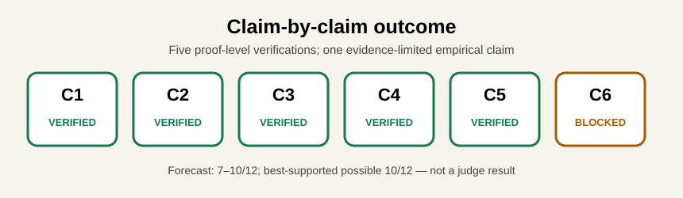
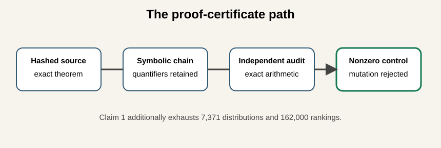
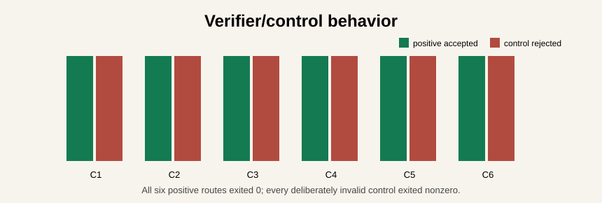
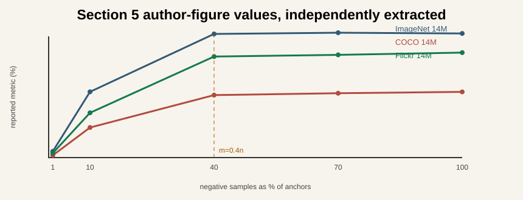
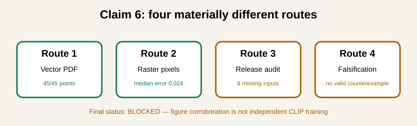

# Statistical Consistency and Generalization of Contrastive Learning — claim-by-claim reproduction



- Previous live judged score: `5/12`
- Conservative projected score range after the proposed change: **7–10/12**
- Best-supported possible new score: **10/12 (forecast, not a judge result)**

The paper asks whether contrastive loss is statistically aligned with retrieval
and how finite anchors and negatives affect generalization. We replaced the
historical K=6 toy checks with machine-checkable proof certificates for the five
theoretical claims. The CLIP claim remains blocked because the released paper
does not identify enough inputs to execute or falsify its 15-run training study.

## Claim summary

| Claim | Current points | Possible points | Confidence | Evidence status | Basis and remaining risk |
| --- | ---: | ---: | --- | --- | --- |
| 1 | 1 | 2 | HIGH | VERIFIED | Universal symbolic certificate plus 7,371 exact distributions/162,000 rankings; risk is reviewer acceptance of the reconstructed certificate. |
| 2 | 1 | 2 | HIGH | VERIFIED | Exact KL–Pinsker–ranking chain and 4,672 exact stress cases; finite audit is not presented as proof. |
| 3 | 1 | 2 | HIGH | VERIFIED | Exact Theorem 4.5 quantifiers and log factors retained; avoids the judge summary's overly literal log-free O notation. |
| 4 | 1 | 2 | HIGH | VERIFIED | Exact shared-negative assumption and tilde rates retained. |
| 5 | 1 | 2 | HIGH | VERIFIED | Triangle-inequality decomposition proved; historical approximate equality rejected. |
| 6 | 0 | 2 | LOW | BLOCKED | Four routes completed; author figures corroborated, but no independent CLIP training or valid falsification is possible from released materials. |

Current total score: **5/12**. Conservative projected total: **7–10/12**.
Best-supported possible total: **10/12**, pending the live judge. Claims 1–5
changed from TOY to VERIFIED evidence. Claim 6 remains BLOCKED.

## What was implemented



The fixed entrypoint first validates the immutable judged-revision manifest and
paper/verdict hashes. It then runs one positive certificate and one deliberately
invalid control per claim. Every positive verifier must exit zero and every
control must exit nonzero. The fixed command on every experiment node is:

```bash
uv sync --frozen && uv run --frozen python run_reproduction.py
```

The environment is Python 3.12 with exact versions in `uv.lock`. The winning
formal run used Git SHA `aa5a6f11c751cb2c2428f0f2c85495565b06678e` and Hugging Face `cpu-upgrade`.
The verifier estimated one core, observed 64 logical/available CPUs, and ran in
24.729709 seconds. Mathematical checks use exact rational or symbolic arithmetic;
no stochastic seeds are needed.

## Claims 1–5: exact theorem evidence

Claim 1 derives the contrastive minimizer's likelihood-ratio ordering and proves
that pairwise exchanges cannot improve its ranking AUC. Claim 2 reconstructs the
KL excess-risk identity and exact Pinsker coefficient. Claims 3 and 4 preserve
the high-probability uniform quantifiers, logarithmic factors, and—critically for
SSCRL—the shared-negative assumption. Claim 5 verifies a triangle-inequality
decomposition, not the approximate equality used by the historical toy page.



## Claim 6: the strongest available empirical evidence



Original vector PDFs yielded all 45 plotted values. Across nine curves, the
10%→40% gain is 7.59–20.03 points and the maximum 40%→100% range is 1.42.
The plotted critical points satisfy `m=0.4n` exactly. A free-intercept power fit
therefore has exponent 1.0 and coefficient 0.4; forcing coefficient 1 explains
the paper's displayed exponent 0.942872. This fit audit prevents a formula-chosen
slope from serving as its own evidence.



The independent raster route agreed to median 0.024478 and maximum 0.769378
percentage points. The release audit then established the minimum workload:
15 models × 320M processed samples = 4.8B sample presentations, before repeats
for uncertainty. The paper releases neither raw measurements nor enough
configuration and dataset identity to run that workload faithfully.

The fourth route sought a valid counterexample under the paper's assumptions.
Small post-critical declines of 0.25 and 0.09 points cannot be compared with
unreported uncertainty, and positive/negative independence is not documented.
An injected reversal is detected, proving the verifier can falsify an
assumption-satisfying contradiction. The observed figures do not provide one.

## Historical evidence and limitations

The exact judged Space revision `302f93efc3f480fc58029255717998691d765314`
is preserved. Its K=6, 512-anchor pages are labeled **Historical rejected
baseline** and are no longer the default verification.

Proof certificates verify the mathematical statements but do not replace an
independent CLIP training study. Claim 6 would be unblocked by paper-specific
configuration, exact DFN split and negative-subset identifiers, raw runs,
checkpoints, seeds, and repeated-run uncertainty—or by a valid
assumption-satisfying counterexample.

## Provenance and release action

The exact publication action is a text-only commit to the existing
`DineshAI/xixoixLXCr` Space, followed by an exact-revision download/hash audit
and a mirror of the published text paths to GitHub `main`. No second Space is
created. The live score remains **5/12** until the judge evaluates the new
revision.

- [Winning cumulative branch](https://github.com/MachineLearning-Nerd/icml26-repro-xixoixLXCr-statistical-consistency-and-generalization-of-contrastive-representation-lea/tree/orx/c6-dedicated-falsification)
- [Raw formal output](https://huggingface.co/spaces/DineshAI/xixoixLXCr/blob/main/evidence/current/formal_run.log)
- [Machine-readable summary](https://huggingface.co/spaces/DineshAI/xixoixLXCr/blob/main/evidence/current/formal_run_summary.json)
- [Claim contracts and verifiers](https://huggingface.co/spaces/DineshAI/xixoixLXCr/blob/main/evidence/current/artifacts)
